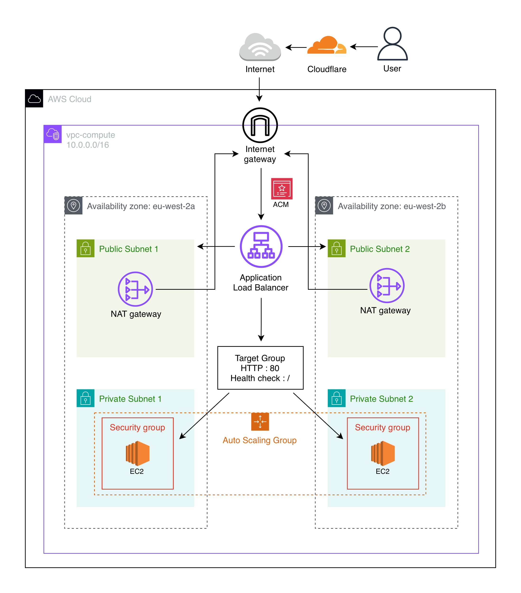
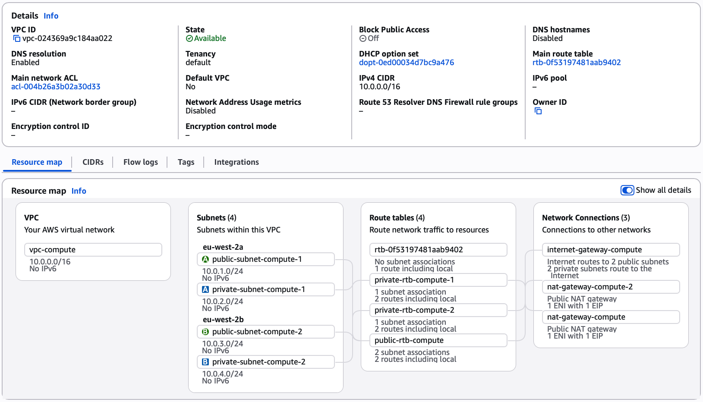
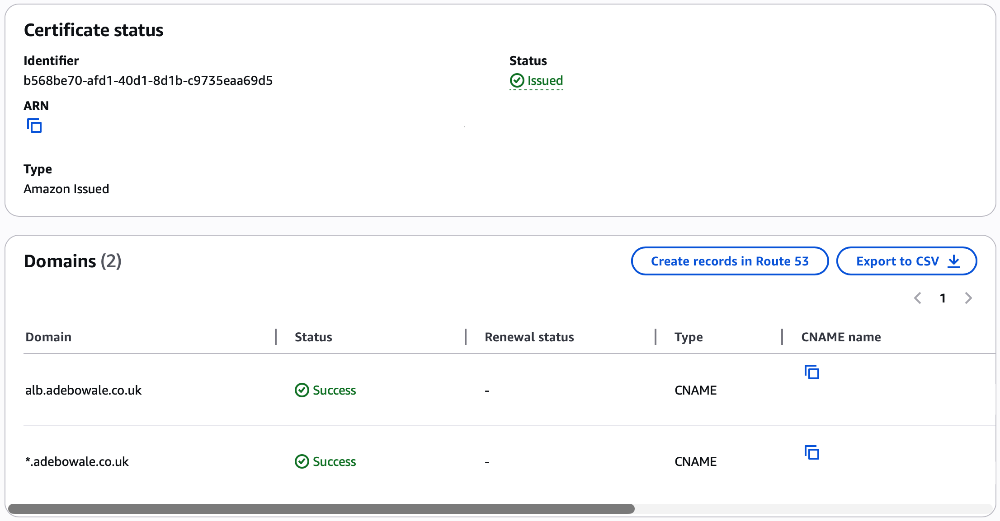
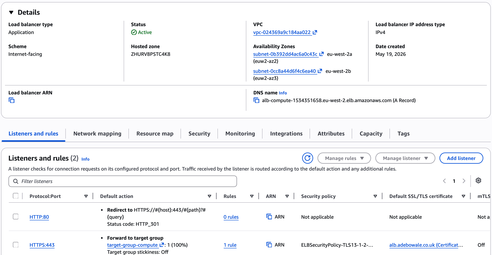
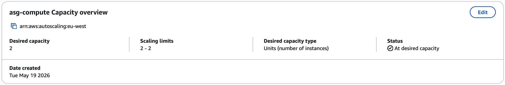
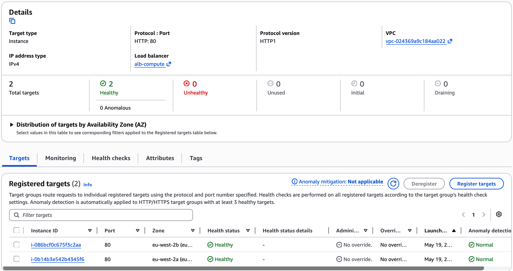

# ALB Compute

A production-style AWS setup deploying highly available private EC2 infrastructure behind an Application Load Balancer across two availability zones, with HTTPS termination via ACM and DNS managed through Cloudflare.

## Infrastructure breakdown

- **Custom VPC** across two AZs with public and private subnets
- **Internet gateway** for public outbound access
- **Two NAT gateways** with Elastic IPs for private outbound access
- **Launch template** for consistent ASG instance configuration
- **Auto Scaling Group** across both private subnets
- **Target group** with HTTP health checks
- **Application Load Balancer** across both public subnets
- **Two listeners** HTTP redirect and HTTPS forwarding
- **Two security groups** ALB and EC2 with least privilege access
- **ACM certificate** for HTTPS termination
- **Cloudflare DNS** for domain routing and certificate validation

## Architecture diagram

## Infrastructure setup

### 1. VPC and subnets

- A custom VPC was created with four subnets split across two availability zones, eu-west-2a and eu-west-2b.
- Splitting subnets across two AZs ensures a highly available setup where the ALB and EC2 instances remain available if one AZ experiences an outage.
- Outbound internet access for private instances was also designed with multi-AZ redundancy by deploying a NAT gateway in each availability zone.

### 2. Connectivity

An Internet gateway (IGW) was created and attached to the VPC to provide public internet access for resources in the public subnets.

A NAT gateway was provisioned in each public subnet with dedicated Elastic IPs. This allows EC2 instances in the private subnets to reach the internet for package installs while remaining privately isolated.

Each private subnet routes outbound traffic to the NAT gateway within the same availability zone to improve fault tolerance and avoid cross-AZ dependencies.

Three route tables were configured and associated with their respective subnets.

| Route table | Associated subnets | Target |
|---|---|---|
| public-rtb-compute | Both public subnets | 0.0.0.0/0 via IGW |
| private-rtb-compute-1 | private-subnet-compute-1 | 0.0.0.0/0 via NAT gateway 1 |
| private-rtb-compute-2 | private-subnet-compute-2 | 0.0.0.0/0 via NAT gateway 2 |

### 3. Security groups

Two security groups were configured to enforce traffic flow through the ALB only.

**ALB security group**

Inbound HTTP and HTTPS from anywhere. This is the only resource directly exposed to the internet.

| Type | Protocol | Port | Source |
|---|---|---|---|
| HTTP | TCP | 80 | 0.0.0.0/0 |
| HTTPS | TCP | 443 | 0.0.0.0/0 |

**EC2 security group**

Inbound HTTP from the ALB security group ID only. EC2 instances are not directly accessible from the internet.

| Type | Protocol | Port | Source |
|---|---|---|---|
| HTTP | TCP | 80 | ALB security group ID |

### 4. ACM certificate

A public SSL certificate was requested in ACM for `alb.adebowale.co.uk`. ACM provided a CNAME record for domain validation which was added in Cloudflare DNS set to DNS only to allow ACM to verify ownership.

### 5. Launch template

A launch template was created to ensure each instance launched by the Auto Scaling Group has a consistent configuration and web server setup without manual intervention.

| Setting | Value |
|---|---|
| AMI | Amazon Linux 2023 |
| Instance type | t3.micro |
| Security group | EC2 security group |
| Public IP | Disabled |

A user data script was included to install and start Apache on launch, serving a simple page that displays the instance hostname. This allows traffic distribution across instances to be verified during testing.

### 6. Target group

A target group was created with HTTP on port 80 pointed at the VPC, with a health check on the root path `/`. Targets were left empty at this stage as the Auto Scaling Group registers instances automatically on launch.

### 7. Application Load Balancer

An internet-facing ALB was created across both public subnets with the ALB security group attached.

Two listeners were configured:

- The HTTP listener was configured to redirect to HTTPS rather than forward, ensuring all traffic is encrypted end to end. 
- The HTTPS listener forwards traffic to the target group with the ACM certificate attached.

### 8. Auto Scaling Group

An ASG was created using the launch template and assigned to both private subnets across eu-west-2a and eu-west-2b. It was attached to the existing ALB and target group so instances are registered automatically on launch.

Capacity was fixed at two instances to maintain one instance per availability zone for high availability testing while avoiding unnecessary scaling costs.

### 9. Cloudflare DNS

A CNAME record was added in Cloudflare pointing `alb.adebowale.co.uk` to the ALB DNS name. The record was set to DNS only to allow ACM certificate validation and ALB routing to function correctly. 

### 10. Testing

The setup was verified across four checks:

1. HTTPS loads correctly at `https://alb.adebowale.co.uk` with a valid certificate
2. HTTP redirects automatically to HTTPS
3. Refreshing the page alternates between both instances confirming the ALB is distributing traffic
4. Both targets show as healthy in the target group

https://github.com/user-attachments/assets/699c84ff-ba8e-4fc5-866a-32cb8fe1e9bd

## Troubleshooting

**ACM certificate stuck on pending validation**

The ACM certificate for `alb.adebowale.co.uk` remained on pending 
validation for an extended period after the CNAME record was added 
in Cloudflare. The record format and DNS only setting were both 
verified as correct.

The certificate was deleted and re-requested. On the second attempt 
validation completed successfully within minutes.

The likely cause was a propagation issue with the initial request 
rather than a misconfiguration.