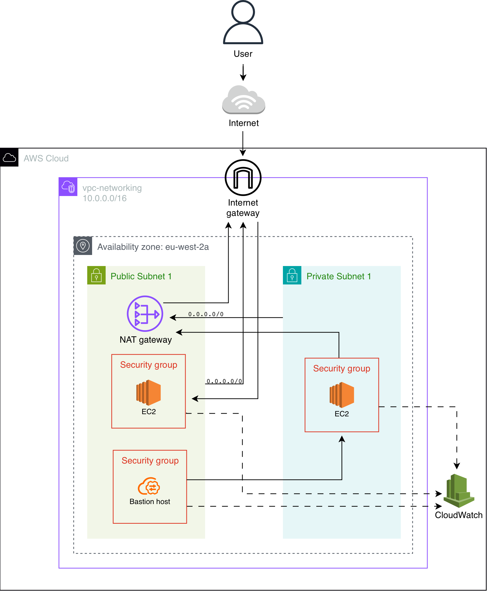
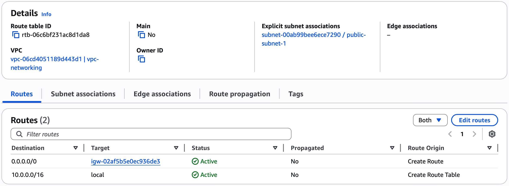
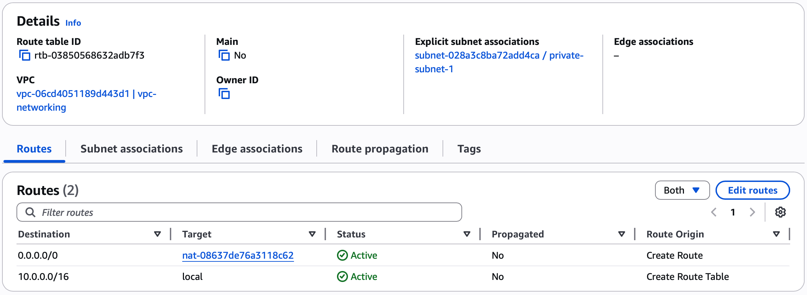
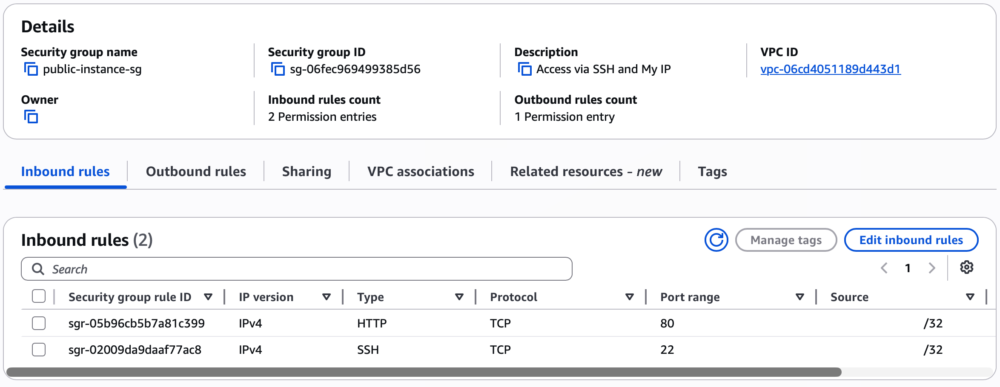
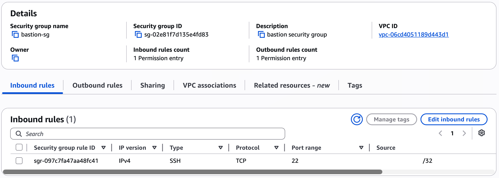
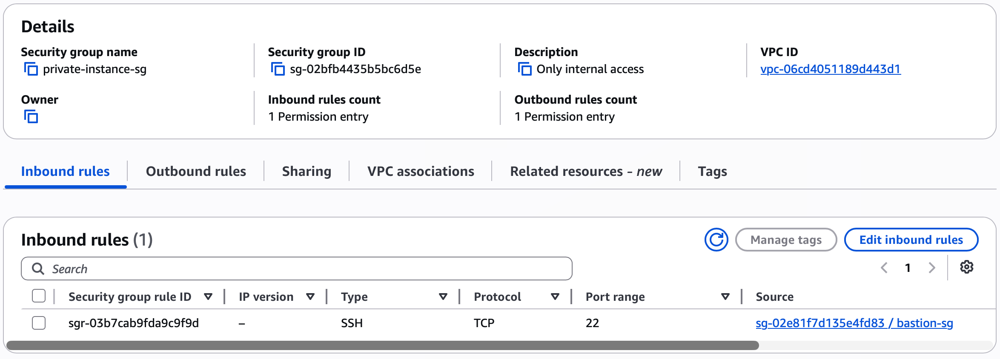
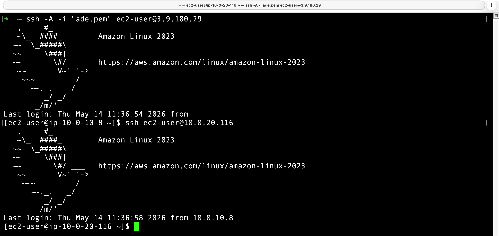
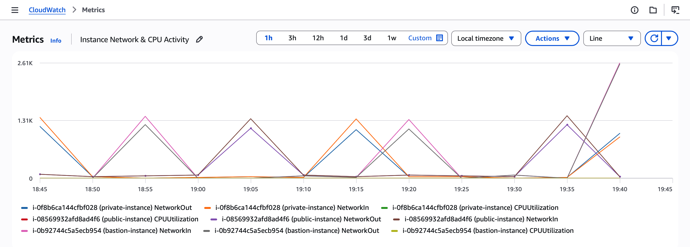

# VPC & Networking

A fully custom AWS network designed and deployed covering VPC architecture, subnet segmentation, routing, and EC2 security.

## Infrastructure breakdown
- **Custom VPC** (10.0.0.0/16)
- **Public and private subnets**
- **Internet gateway** for public outbound access
- **NAT gateway** with Elastic IP in the public subnet
- **Public route table** via Internet gateway
- **Private route table** via NAT gateway
- **Public EC2** with SSH and HTTP locked to my IP
- **Private EC2** with internal access only
- **Bastion host** in the public subnet
- **Three security groups** with least privilege access
- **CloudWatch monitoring** on all instances

## Architecture diagram

> **Note:** This setup is intentionally single AZ to keep costs down 
> for demonstration purposes. In a production environment resources 
> would be distributed across multiple AZs for high availability.

## Infrastructure setup

### 1. VPC Setup 
A custom VPC was created with the CIDR block 10.0.0.0/16. This provides 65,536 available IP addresses and serves as the isolated network environment for all resources in this project.

Two subnets were created within the VPC. 
- The public subnet (10.0.10.0/24) hosts internet facing resources.
- The private subnet (10.0.20.0/24) was setup to have no direct internet access and is reserved for 
internal resources only.

### 2. Public internet routing

An Internet gateway was created and attached to the VPC to enable outbound internet access for resources in the public subnet.

A NAT gateway was created in the public subnet and associated with an Elastic IP address.

This allows resources in the private subnet to reach the internet outbound without being directly exposed to it.

### 3. Route table configuration

Two route tables were created and associated to their respective subnets.

**Public route table**
- Associated to the public subnet
- Routes 0.0.0.0/0 traffic to the Internet gateway

**Private route table**
- Associated to the private subnet
- Routes 0.0.0.0/0 traffic to the NAT gateway

This ensures public subnet resources can communicate directly with the internet, while private subnet resources route outbound traffic through the NAT gateway.

### 4. EC2 instances

Three instances were deployed across the public and private subnets.

| Instance | Subnet | Public IP | Purpose |
|---|---|---|---|
| Public instance | Public | Yes | Internet facing entry point |
| Bastion host | Public | Yes | Dedicated access point to private instance |
| Private instance | Private | No | Internal resources only |

The private instance can only be reached internally through the bastion host.

### 5. Security

Three security groups were configured to control access across the infrastructure.

**Public instance security group**

Inbound SSH and HTTP access was restricted to the local machine IP only. This ensures the instance is not openly accessible from the internet.

**Bastion security group**

Inbound SSH access was restricted to the local machine IP only, providing a controlled entry point into the private instance.

**Private instance security group**

Inbound SSH access was restricted to the bastion security group ID as the source rather than a specific IP address. This ensures only the bastion host can reach the private instance internally regardless of IP changes.

### 6. Testing

**Public instance**

The public instance was verified by accessing it directly via the public IP address in a browser.

**Private instance**

Access to the private instance was verified by connecting to the bastion host via SSH and tunnelling through to the private instance internally.

### 7. CloudWatch monitoring

Detailed monitoring was enabled on all instances. Metrics including CPU utilisation, network in, and network out were verified in CloudWatch.

## Troubleshooting

**SSH into private instance timing out**

Attempts to SSH into the private instance from the bastion host were timing out. After checking route tables, network ACLs, and security group rules, the bastion host and its security group were recreated. Access to the private instance was confirmed immediately after.

The likely cause was a misconfiguration in the original bastion security group, either an incorrect inbound rule or a misreferenced security group ID in the private instance inbound rules.